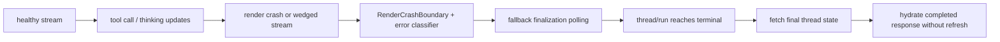

# Replace the Current `plan.md` With a Fallback-First Revision

## Summary

The previous `plan.md` was useful for the first React `#185` pass, but parts of it became stale after the branch already landed several mitigations:

- shallow-equality busy subscriptions,
- ref-based polling cadence,
- `AssistantMessage` memoization,
- ref-based Thinking-panel scroll stickiness.

The remaining gap is narrower and more specific:

- contain React `#185` so the app shell and run controller stay alive,
- treat React `#185` as a recovery trigger instead of only suppressing the toast,
- add a finalize-only polling fallback when streaming is no longer trustworthy,
- reduce churn when the intermediate artifact stays open during tool-call streaming.

## What to Keep vs Replace

Keep from the old plan:

- the state-machine framing around `useStream`, backend status polling, reconnect intents, and shadow run IDs,
- the idea that React `#185` is dangerous because the backend run may still be active,
- the requirement for a non-stream backup path.

Replace from the old plan:

- do not redo a broad busy-state reducer rewrite in `src/components/thread/index.tsx` unless fresh evidence proves it is still the live culprit,
- do not treat `ArtifactSlot isEmpty` oscillation as the primary root cause for the intermediate-step crash,
- do not live-paint partial polling snapshots; fallback UX is finalize-only.

## Updated Implementation Plan

- Add a render-error boundary around the chat message render zone in `src/components/thread/index.tsx`.
- Catch React `#185` / max-depth-style render failures from the assistant/tool/intermediate subtree and notify `Thread` without tearing down the stream/recovery controller.
- Extend the existing error handling so `benign_react_185` triggers a finalization-fallback intent instead of only logging and returning.
- Add `src/hooks/use-run-finalization-fallback.ts`.
- The new hook must:
  - accept `threadId`, `threadStatus`, `latestRunStatus`, run identity hints, and a fallback intent,
  - poll `threads.get(...)` plus `runs.get(...)` / `runs.list(...)` until the run becomes terminal or the thread is no longer `busy`,
  - fetch `threads.getState(threadId, undefined, { subgraphs: true })` after terminal,
  - expose a final-state snapshot override back to `Thread`.
- Keep reconnect-first behavior for normal transport issues in `use-stream-auto-reconnect.ts`.
- If reconnect is exhausted while backend state is still active, escalate to the finalization fallback instead of leaving the UI stranded.
- Make `Thread` render from the final snapshot override only after fallback hydration finishes.
- During fallback polling, keep loading/cancel/history/intermediate-step UX authoritative, but do not render partial polled content.
- Keep cancel behavior unified. `handleCancel()` must clear reconnect state, fallback-finalization state, shadow run state, and any final snapshot override together.
- Reduce open-panel churn in `src/components/thread/messages/ai.tsx` by:
  - keeping the `Intermediate Step` trigger/status tied to the live state,
  - rendering the open artifact body from a deferred snapshot of grouped intermediate parts,
  - applying the same deferred treatment to the open Thinking-panel body,
  - leaving the closed trigger path unchanged.
- Avoid the currently dirty reconnect test files as the first implementation surface; add fresh test files instead.

## Test Plan

- Add one deterministic Playwright spec that validates the backup lane itself.
- Start a tool-heavy run, inject a React-185-style stream failure after streaming begins, and assert:
  - no generic fatal toast,
  - finalization status is shown,
  - final assistant output appears without refresh.
- Add one soak-style Playwright spec that uses this exact prompt three fresh-thread runs in sequence:
  - `Genrate a topic of 6 ct eahc have 3 varaints on the basis latest question trends in jee advanced exam on complex number.`
- For each run, assert:
  - `Cancel` appears,
  - the run eventually completes,
  - assistant output is non-empty,
  - no React `#185` / max-depth signal is observed.
- Add one panel-open soak spec with the same prompt.
- Open `Intermediate Step` as soon as it appears, keep it open through completion, and assert:
  - no React render-instability signal,
  - no stuck spinner loss,
  - completed assistant output.
- Re-run adjacent regressions:
  - silent stream close recovery,
  - reconnect final reconciliation,
  - final stream continuity,
  - history spinner synchronization.

## Assumptions and Defaults

- This revision replaces the older sections of `plan.md` that describe already-landed fixes rather than the remaining gap.
- Fallback UX is finalize-only.
- Final snapshot hydration may temporarily lose fresh per-message branch metadata; completed message correctness is the priority.
- The main code change should center on:
  - `src/components/thread/index.tsx`,
  - `src/components/thread/messages/ai.tsx`,
  - `src/hooks/use-run-finalization-fallback.ts`.
